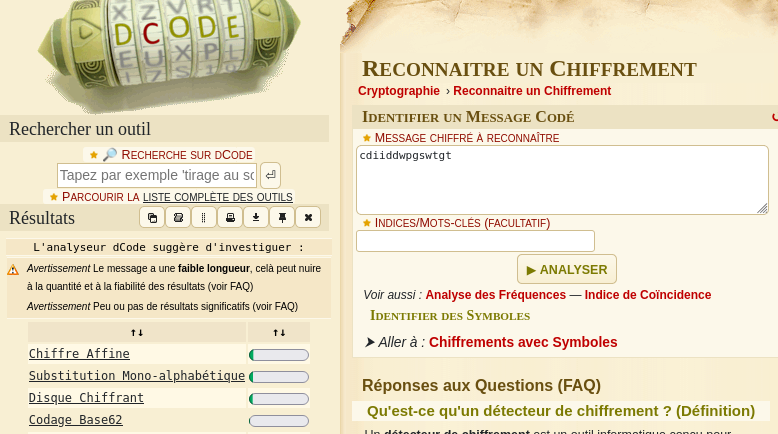
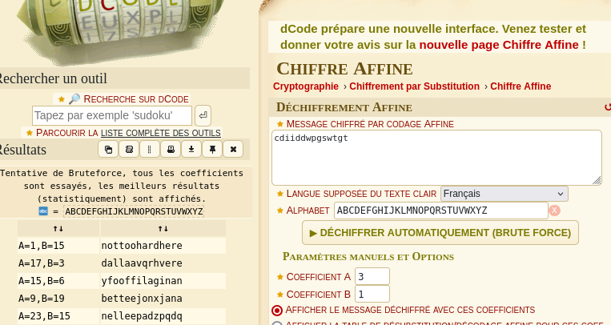

# LEVEL 00

## Summary

Find the user flag00's files, use their content in an [encryption solver](https://www.dcode.fr/identification-chiffrement) to get the flag.

## Workflow

1. The directory `/home/user/level00` is empty. Searching for files owned by user `flag00`.
	```
	level00@SnowCrash:~$ find / -user flag00 2>/dev/null
	/usr/sbin/john
	/rofs/usr/sbin/john
	```

2. Print the content of both files.
	```
	level00@SnowCrash:~$ cat /rofs/usr/sbin/john /usr/sbin/john
	cdiiddwpgswtgt
	cdiiddwpgswtgt
	```

3. Use it in an [encryption identifier](https://www.dcode.fr/identification-chiffrement) to detect potential ciphers.
	Results: Chiffre Affine => `A=1,B=15	nottoohardhere`, `A=17,B=3	dallaavqrhvere` and so on...

	
	


4. The only result that makes sense is `nottoohardhere`, tested it successfully as the flag.
	```
	level00@SnowCrash:~$ su flag00
	Password:
	Don't forget to launch getflag !
	flag00@SnowCrash:~$ getflag
	Check flag.Here is your token : x24ti5gi3x0ol2eh4esiuxias
	flag00@SnowCrash:~$
	```