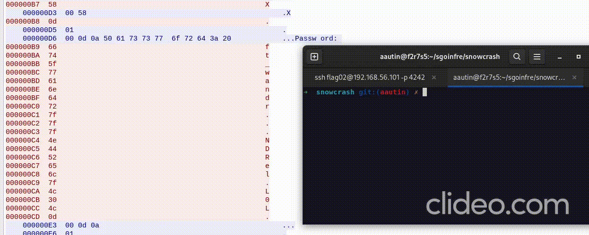

# LEVEL 02

## Summary

Analyze a .pcap file with Wireshark, packets inspection.

## Workflow

1. The directory `/home/user/level02` contains a .pcap file, let's copy it in host machine.
	```
	level02@SnowCrash:~$ base64 -d level02.pcap.b64
	{CONTENT OF THE FILE}
	```
	```
	level01 git:(aautin) $ echo {CONTENT OF THE FILE} > here
	level01 git:(aautin) $ base64 -d here > level02.pcap
	```

2. Open the level02.pcap file with Wireshark. Context :
	```
	level02@SnowCrash:~$ man ascii
	Oct   Dec   Hex   Char
       ──────────────────
	...
	015   13    0D    CR  '\r' (carriage return)
	...
	177   127   7F    DEL
	...
	```

3. Rebuild the password correctly and use it to connect and get the flag.
	
